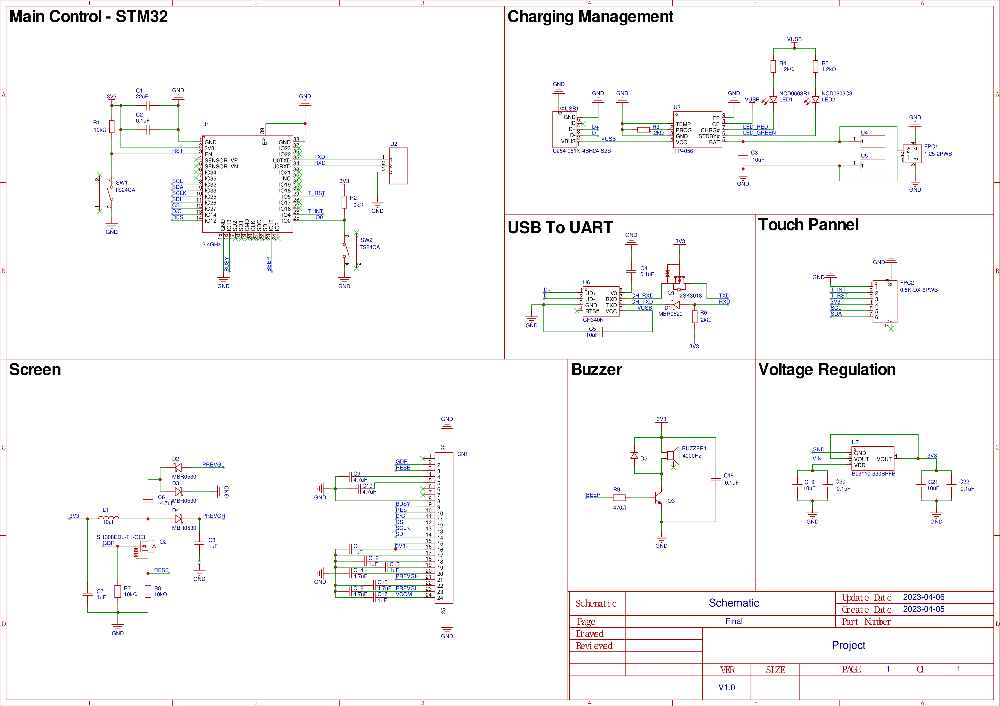

# Portable Multi-Function Device
## Overview 
A portable STM32 device that can display the current time &amp; weather, act as a Pomodoro timer with alarm &amp; and connect to the internet for more functions

## Requirement Analysis
To satisfy the expected functions on the portable device, the mind map below displayed the essential processes and components with all required Hardware & Software ports. 

## Schematic Design
By referencing the data sheets for major components, the schematic is separated into different section as shown below. The USB to UART section also includes the backflow prevention design using MOS (Metal Oxide Semiconductor), which prevent the unacceptable voltage to damage the components.

## PCB Layout 
For various reasons, the PCB board has the size of 33.4 mm * 37.0 mm. It was followed design from schematic and arranged the position for different components for better contestability and less crosstalk.
 

## Contributing 
Pull requests are welcome. If you have any suggestion or questions, please open an issue to let me know. 